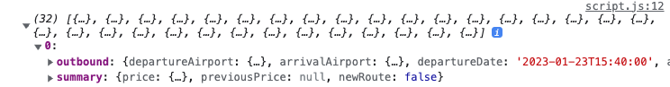
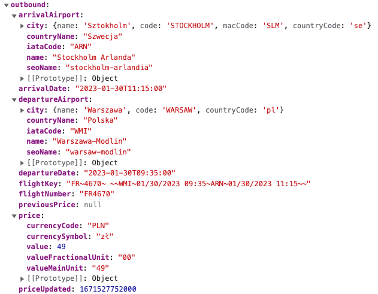
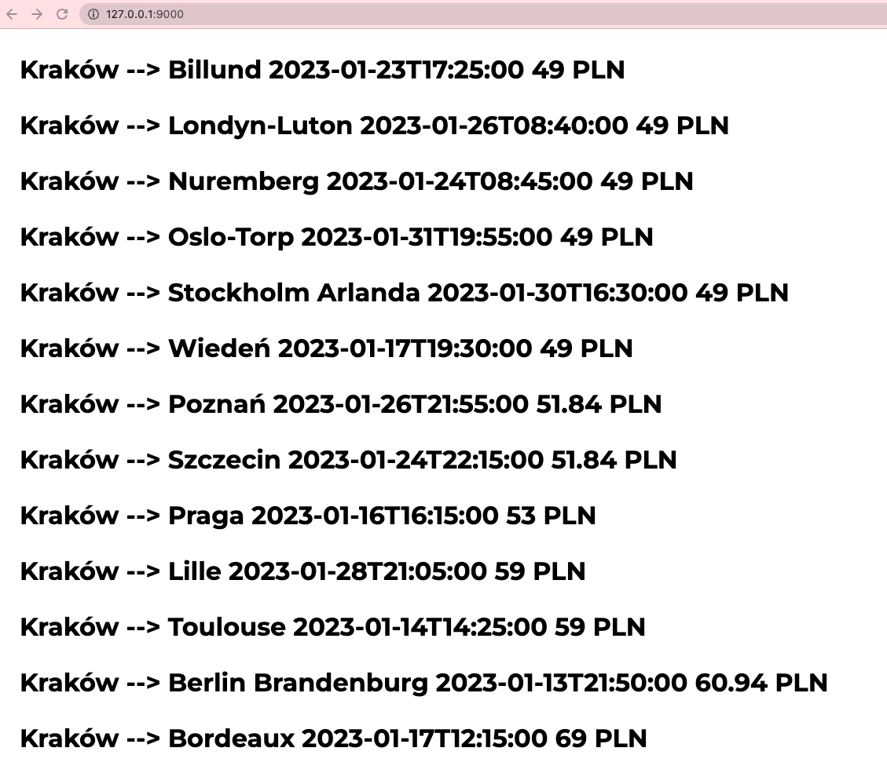
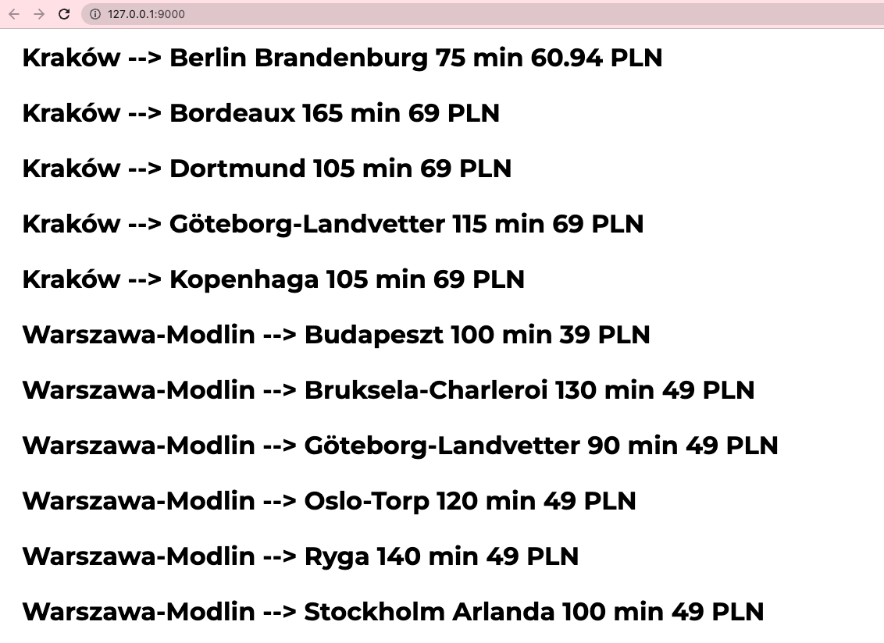

# FLIGHT FARES
The data are flights from many different airports that have been saved in `data.js` file.
List includes objects, which contain two kays `outbound` and `summary`.

All data for a single flight is included in the key `outboubd`.

E.g. 
For the flight from `Warszawa-Modlin` to `Stockholm Arlanda` there is object:

## TASK 1

Display on page flights in `h2` tag according to the below example:

departureAirport.city.name —> arrivalAirport.city.name arrivalDate price.value
price.currencySymbol

eg. 
Kraków - Barcelona 2022-12-21T14:00:00 98 zł

## TASK 2
Find the first cheapest fare - return the departure, arrival airport and it's price in an object.

## TASK 3
How many flights from Kraków to Dortmund are in the list - return a number?

## OPTIONAL TASK
On the list from task 1 display flight duration in minutes.

